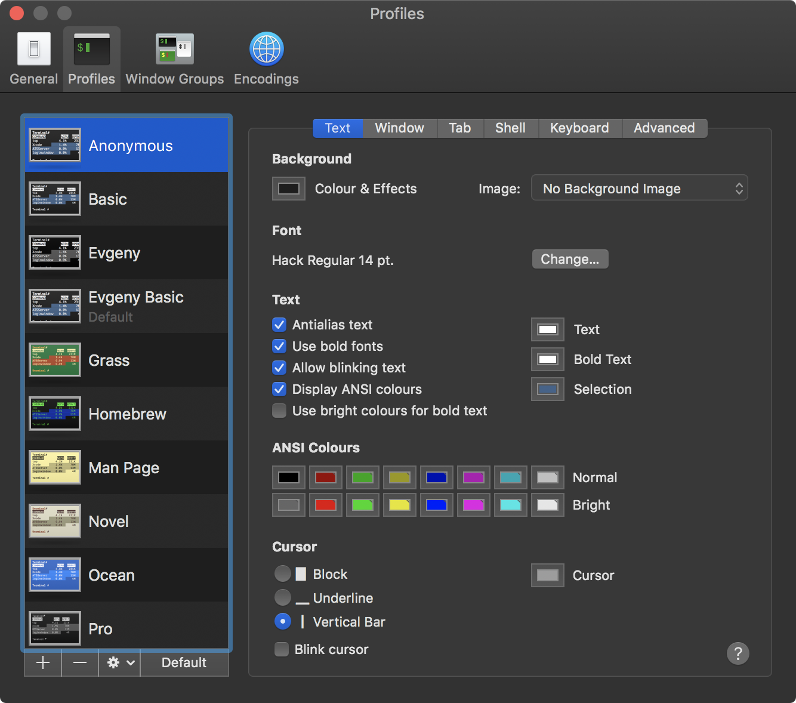

# Настройка терминала

[Назад](../README.md)

Для начала, несколько определений:

<dl>
  <dt><strong>Командная оболочка (shell)</strong></dt>
  <dd>
    Программа, которая предоставляет пользователю <a href="https://ru.wikipedia.org/wiki/Интерфейс_командной_строки">CLI</a>
    или <a href="https://ru.wikipedia.org/wiki/Текстовый_интерфейс_пользователя">TUI</a> для управления ОС
  </dd>

  <dt><strong>Эмулятор терминала</strong></dt>
  <dd>Программа, используемая для взаимодействия с различными командными оболочками</dd>
</dl>

Командная оболочка по умолчанию — `bash` версии 3.2 (2007 года!).

Также в macOS уже есть эмулятор терминала. Найти его можно с помощью Launchpad:


По умолчанию он выглядит довольно бедно:


## Делаем красиво и удобно

- Поставим пакетный менеджер HomeBrew
- Установим последнюю версию bash
- Настроим Terminal чтобы выглядел красиво
- Настроим bash
- Настроим nano

### Установка HomeBrew

Это пакетный менеджер похожий на `apt` из Ubuntu. Им пользуется почти каждый маковод для того чтобы устанавливать, обновлять и удалять консольные и оконные программы, библиотеки, шрифты.
Используй его и только в крайнем случае ставь программы так как делают это пользователи Windows.
Он позволит держать Mac в чистоте и в случае проблем с ним можно просто снести директорию `/usr/local`.

Чтобы установить, откроем Terminal и вставим следующую команду:

```bash
/usr/bin/ruby -e "$(curl -fsSL https://raw.githubusercontent.com/Homebrew/install/master/install)"
```

Кажется это единственная полезная программа написанная на Ruby :)

Все программы ставятся по инструкциям, которые называются "Формулы".
Все формулы лежат в [открытом репозитории](https://github.com/Homebrew/homebrew-core/tree/master/Formula) на GitHub.

Основные команды HomeBrew:

- `brew search [TEXT|REGEX]` — поиск программ
- `brew info [FORMULA...]` — показ информации
- `brew install [FORMULA...]` — установка
- `brew uninstall [FORMULA...]` — удаление
- `brew upgrade` — обновление
- `brew list` — просмотр списка установленных
- `brew cleanup` — очистка устаревших файлов

Добавим теперь два репозитория HomeBrew помимо основного:

```bash
brew tap Caskroom/cask # Репозиторий с оконными программами
brew tap Caskroom/fonts # Репозиторий со шрифтами
```

Работать с репозиториями отличными от основного можно похожим образом:

- `brew cask install` - установка
- `brew cask uninstall` - удаление
- `brew cask upgrade` - обновление

### Установка bash

Установим свежий `bash` и пакет автодополнений к нему:

```bash
brew install bash bash-completion
```

Теперь откроем настройки Terminal:


И поменяем команду с которой запускается Terminal на `/usr/local/bin/bash`:


После этого закроем окна программы и перезапустим её. Должен запуститься свежий `bash`.
Чтобы это проверить, наберём команду:

```bash
echo $BASH_VERSION
```

В переменной окружения `BASH_VERSION` должно лежать примерно такое значение - `4.4.23(1)-release`.

### Настройка Terminal

Вернёмся в настройки Terminal, но на вкладку с профилями:


Склонируем базовый профиль:


Назовём его, например, Anonymous.

Начнём настраивать профиль со вкладки Text:



На ней я обычно делаю следующее:

- В background увеличиваю opacity ("непрозрачность") до 100%
- Увеличиваю размер шрифта до 14
- Делаю курсор вертикальной чертой и ставлю ему более светлый цвет для контрастности

Обязательно проверь что стоит галочка "Antialias text"!

Продолжим настраивать, перейдём на вкладку Window:


Для более комфортной работы, рекомендую на ней поменять Columns до 100 и Rows до 26.
Будет влезать больше информации, но окно не будет огромным.

Осталось только зайти на вкладку Shell и добавить `-bash` в список:


Это нужно чтобы Terminal не спрашивал каждый раз можно ли ему закрыться.

После этих настроек, нужно сделать профиль Anonymous дефолтным:


Можно закрыть все окна, перезапустить Terminal и полюбоваться результатом:


### Настройка Bash

Закончились красивые скриншоты. Теперь нужно настроить саму командную оболочку.
Большая часть настроек хранится в файле `.bash_profile`, который находится в домашней директории.
Он выполняется каждый раз когда открывается окно терминала.

Установим консольный текстовый редактор, которым будем редактировать этот файл:

```bash
brew install nano
```

Теперь откроем `.bash_profile` с помощью `nano` и будем его заполнять:

```bash
nano ~/.bash_profile
```

Установим длину tab, которая изначально равняется 8. Значение в 4 выглядит более опрятно:

```bash
tabs -4
```

Установим редактор, который будет открываться в консоли по умолчанию и заодно локали:

```bash
export EDITOR=nano
export LANG=en_US.UTF-8
export LC_ALL=en_US.UTF-8
```

Можно было заметить, что на скриншотах другое приглашение командной строки. На них оно цветное.<br>
Это регулируется переменной окружения `PS1`. Выставим её:

```bash
export PS1="\[\033[38;5;11m\]\u\[$(tput sgr0)\]\[\033[38;5;231m\]@\[$(tput \
sgr0)\]\[\033[38;5;11m\]\h\[$(tput sgr0)\]\[\033[38;5;231m\]:\[$(tput \
sgr0)\]\[\033[38;5;6m\][\w]:\[$(tput sgr0)\]\[\033[38;5;15m\] \[$(tput sgr0)\]"
```

Сделаем цветастым вывод команды `ls`:

```bash
export CLICOLOR=1
export LSCOLORS=ExFxBxDxCxegedabagacad
alias ls="ls -GFhl"
```

И самое важное, включим автокомплит:

```
if [ -f $(brew --prefix)/etc/bash_completion ]; then
    source $(brew --prefix)/etc/bash_completion
fi
```

Теперь нажимая на tab можно получать полезные подсказки от программ.

Итоговый `.bash_profile`:


Ещё немного сделаем жизнь проще. Настроим автокомплит `bash` чтобы он был независимым от регистра,
а также сделаем так чтобы можно было с помощью `Option + ←` и `Option + →` переключаться между словами в консоли.

Для этого откроем файл `~/.inputrc`:

```bash
nano ~/.inputrc
```

И вставим в него следующее содержимое:

```bash
"\e\e[D": backward-word
"\e\e[C": forward-word

set completion-ignore-case on
```

### Настройка Nano

Уделим чуточку времени nano чтобы он тоже стал лучше. Настройки редактора хранятся в `~/.nanorc`

Откроем его и вставим следующее содержимое:

```bash
set tabsize 4
include "/usr/local/share/nano/*.nanorc"
```

Это сделает размер tab также в 4 пробела и включит все доступны подсветки синтаксиса.

<hr>

Готово! Похвастаться результатом можешь с помощью программы `neofetch`, поставь её с помощью `brew`.


## Бонус (Для моделей с Touch ID)

Можно сделать так чтобы команда `sudo` требовала в первую очередь отпечаток пальца, а не пароль.

Для этого нужно открыть файл `/etc/pam.d/sudo`:

```bash
sudo nano /etc/pam.d/sudo
```

И ооооочень-очеень аккуратно добавить в самое начало после комментария строку:

```bash
auth sufficient pam_tid.so
```

Файл должен выглядеть перед сохранением следующим образом:


После сохранения на все вызовы `sudo` будет появляться окно:


[Назад](../README.md)
