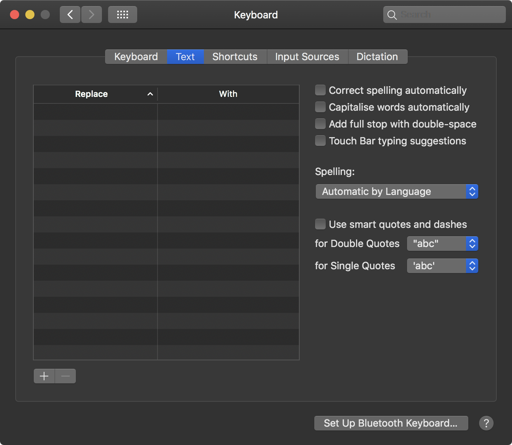

# Настройка системы

[Назад](../README.md)

Пройдёмся по настройкам системы, которые доступны через интерфейс, а также по некоторым,
которые можно выставить только с помощью консоли.

"Панелью управления" в macOS можно считать приложение `System preferences`:


Остановлюсь только на пунктах, где есть нюансы, которые влияют на пользовательский опыт.

## Dock

Здесь находятся настройки дока. Можно настроить так:


- Сами иконки сделаны чуть поменьше
- Включена опция "Minimise windows into application icon", которая сворачивает
  окна в соответствующую им иконку, а не помещает справа от иконок
- Включена опция "Automatically hide and show the Dock", которая скрывает док когда он не нужен
- Отключена опция "Show recent applications in Dock". Она показывала программы, которые я последними
  открывал. Лучше уж управлять содержимым дока самостоятельно

## Mission control

В этом окне настроек содержатся опции связанные с виртуальными рабочими столами.


- Отключена галочка "Automatically rearrange Spaces based on most recent use" потому что
  она сортировала рабочие столы не самым предсказуемым образом, а без неё это делается вручную
- Отключена совсем опция Dashboard. Это экран с бесполезными виджетами, который иногда
  случайно открываешь и он бесит :)
- Отключены горячие клавиши для управления рабочими столами, потому что тачпад решает все эти задачи лучше

## Keyboard

Вот тут очень много всего что нужно отключить. Apple настроили кучу горячих клавиш, которые довольно
бесполезны. Ну вот кому, к примеру, понадобится переводить на китайский по хоткею?)

### Вкладка Keyboard

Настроим под себя "Key Repeat" и "Delay Until Repeat". Они отвечают за то как быстро будут вводиться
повторяющиеся символы при зажатии одной кнопки.


Полезно будет включить эту галочку:


Она сделает так чтобы мультимедийные клавиши были доступны по нажатию Fn + F1...F12,
а сами F12...F12 работали так как привычно. Полезно для кодинга.

### Вкладка Text



Лучше отключить здесь совсем все галочки и удалить все автозамены. Так можно будет самостоятельно
контроллировать всё то что печатаешь.

### Вкладка Shortcuts (самая важная)

Бугага! Всё самое бесполезное здесь. Можно отключать совершенно все галочки кроме тех что в "Input Sources" и "Screenshots". Нет ни шанса воспользоваться другими, а парочка из них будет иначе мешать при кодинге.


## Trackpad

Потыкай первые две вкладки, настрой по своему вкусу и привычкам.
А вот насчёт "More gestures" есть пара советов, которые если применить,
то помогут чуть меньше нервничать при работе с ноутом.


Особенно важны здесь первые два жеста. Лучше сделать переключение вперёд/назад с помощью
трёх пальцев, а переключение между экранами с помощью четырёх.
В таком случае никогда не возникнет ситуации, что при скроллинге странички в браузере вправо-влево,
будет срабатывать "Назад" или "Вперёд".

## Software Update

Рекомендую включить автоматические обновления программ из AppStore и самой macOS.
Система очень ненавязчива в плане обновлений по сравнению с Windows и с каждым апдейтом становится
только лучше.


## Extensions

Здесь сконцентрированы всякие расширения системы, например виджеты центра уведомлений.
Много довольно бесполезных лишних вещей, например виджеты погоды и курса валют.


## Sharing

На этой вкладке можно поменять имя MacBook'а и отключить возможность подключаться к нему
из локальной сети с другого Mac'а.


## Siri

Siri не очень умна, её можно отключить.


## Accessibility

Это окно с настройками нужными для людей с ограниченными возможностями, но в нём много
полезных и для нас настроек.

В General желательно выключить всё:


И VoiceOver тоже:


Вкладка Display самая интересная:


На ней галочка "Reduce transparency" уберёт лишние прозрачности по всей системе.
macOS с ней становится более "матовой", работает чуточку быстрее и дольше.

Можно ещё отключить галочку "Shake mouse pointer to locate",
она убирает увеличивающийся курсор при быстром движении мыши.

## Finder

Finder - аналог проводника из Windows.

Чтобы попасть в настройки нужно открыть Finder в любой директории
и в глобальном меню вызвать Preferences:


На вкладке General для удобства можно убрать лишние элементы с рабочего стола и выставить
`New finder windows show` на домашнюю директорию.


В Advanced рекомендую включить показ расширений файлов, отключить лишние предупреждения,
поместить директории в начало.


## TextEdit

Это текстовый редактор, аналог Notepad из Windows. Рекомендую отключить его "умные" функции
и заставить его сохранять в txt, а не rtf формат. Тогда им будет удобно открывать различные
txt файлы и конфиги.


## Скрытые настройки системы

Не всё можно настроить с помощью System Preferences. В macOS есть штука немного похожая на
реестр Windows. В ней и хранятся эти недостижимые интерфейсом настройки. Обращаться к ним можно
с помощью консольной утилиты `defaults`.

### Зажатие кнопки и ввод повторяющихся символов

Хочется же иногда написать АААААААААААААААААААААА, а вот Apple решили, что вместо этого
лучше показать такое вот окно:


Чтобы от него избавиться, введём в терминале:

```bash
defaults write -g ApplePressAndHoldEnabled -bool false
```

### Директория хранения скриншотов

По умолчанию скриншоты сохраняются на рабочий стол и забивают его. Поменять директорию сохранения
скриншотов на `~/Pictures/Screenshots` можно так:

```bash
mkdir ~/Pictures/Screenshots
defaults write com.apple.screencapture location ~/Pictures/Screenshots
```

[Назад](../README.md)
